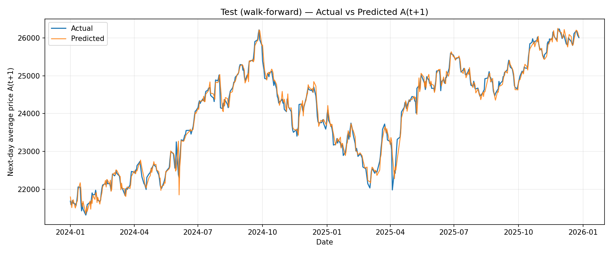
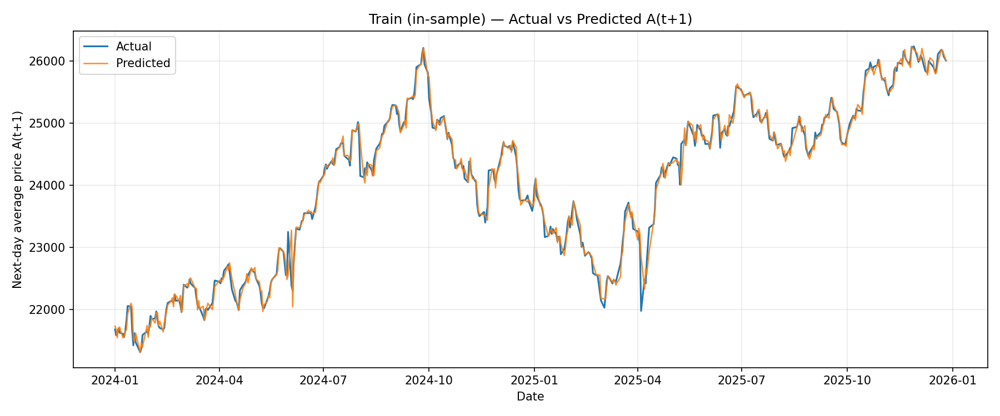

# nifty-option-trading-bot

Research/backtest scaffold for an **expiry-day NIFTY50 options algorithm** using:

## What’s implemented

### Prediction target

We predict the next-day average-price log return:

`log(A(t+1)) − log(C(t))`, where `A = (O+H+L+C)/4` and `C` is today’s close.

### Model

- Two-sided quantiles: 2.5%, 50%, 97.5%
- Rolling training window: 720 days
- Refit cadence: every 5 days
- Conformal calibration widens the [lo, hi] interval to achieve ~95% empirical coverage

### Trading signal

- `z_t`: risk-adjusted signal (median return divided by calibrated interval width)
- `τ_t`: 70th percentile of `|z|` over last ~120 days
- Regime:
	- `|z_t| > τ_t` => **directional** (debit spread)
	- else => **neutral** (iron condor)

### Expiry schedule

- Before **2025-09-01**: Thursday expiry
- On/after **2025-09-01**: Tuesday expiry

Holiday adjustments are not implemented yet.

## Run

Optional (recommended) install:

```bash
python -m pip install -e '.[dev]'
```

Run the backtest:

```bash
python -m nifty_option_trading_bot --start 2024-01-01 --capital 100000
```

## Model evaluation (MAPE + plots)

Measured by converting the predicted log-return into a predicted next-day average price:

`Ahat(t+1) = C(t) * exp(yhat(t))` and comparing against realized `A(t+1)`.

- Train MAPE: **0.0038363**
- Test MAPE: **0.0045298**
- Test MAPE (>= 2024): **0.0040491**

### Actual vs predicted (test)



### Actual vs predicted (train)



## Important caveats

This is a **research** simulator, not a live trading system.

- Options are priced via **Black–Scholes** with an IV proxy (clipped realized vol).
- Trade entry/exit is simplified:
	- enters at **expiry-day close**
	- settles using **next-day close** (since we don’t have intraday options data here)
- Lot sizing, margin, slippage, transaction costs, bid/ask spread are not modeled.

If you want realistic execution, we should plug in:

- Intraday NIFTY + options chain data
- Proper expiry settlement and payoff handling
- Fees / spread / impact model
